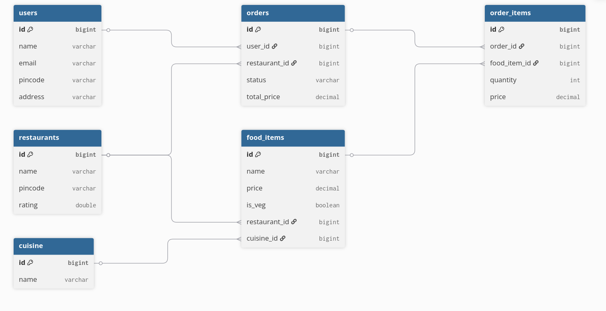

<p align="center">
  
</p>
<br>
<h1 align="center" style="border-bottom: none; padding-bottom: 0; margin-bottom: 0;">Lwiggy</h1>
<br>
<p align="center">
  Lwiggy is a food delivery web app built with React, Spring Boot, MySQL, and Docker, inspired by Swiggy.
</p>
<br>

## Features
- Shows restaurants near your saved pincode
- Search restaurants and dishes in your vicinity
- Add items to cart and place orders
- Track order status
- View order history
- User authentication (signup / login)


## Database Design

<p align="center">
  
</p>

## Setup
### Prerequisites
- [Docker](https://docs.docker.com/get-docker/) with Docker Compose
- Git

### Installation

1. **Clone the repository :**

   ```bash
   git clone <repo-url>
   cd lwiggy
   ```

2. **Set up environment variables :**

   ```bash
   cp .env.example .env
   ```

   Open `.env` and fill in :
   - `MYSQL_ROOT_PASSWORD` and `DB_PASSWORD` — any password you want
   - `JWT_SECRET` — generate one with `openssl rand -base64 48`
   - `CORS_ALLOWED_ORIGIN` and `VITE_API_BASE_URL` — set both to `http://localhost`

### Running the app

```bash
docker compose up -d --build
```

Open http://localhost in your browser.
